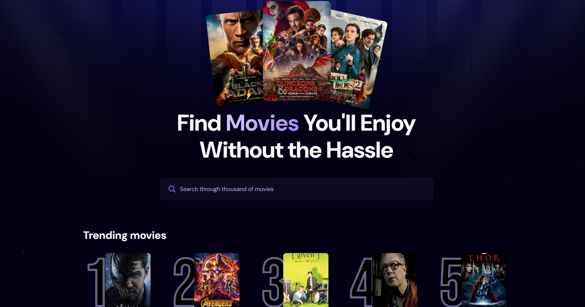

# 🎬 Movie App

A clean and minimal movie discovery app powered by The Movie Database (TMDb) API. Search, explore trending titles, and view details for thousands of movies effortlessly.

🔗 **Live Preview**: [https://movie-app-cap9.vercel.app/](https://movie-app-cap9.vercel.app/)

---

## 📸 Screenshots

### 🎥 Hero Section



---

## ⚙️ Features

* 🔍 Debounced movie search to reduce API calls
* 🎞️ View trending movies (fetched from Appwrite database)
* 🍿 Movie details with posters and popularity
* ⏳ Loading spinner and clean UI

---

## 🚀 Technologies Used

* React (Vite)
* Tailwind CSS (for styling)
* Appwrite (for backend trending data & analytics)
* TMDb API (for movie data)

---

## 🔧 Setup Locally

1. Clone the repository:

```bash
git clone https://github.com/your-username/movie-app.git
```

2. Navigate into the project folder:

```bash
cd movie-app
```

3. Install dependencies:

```bash
npm install
```

4. Create a `.env` file in the root and add your TMDb API key:

```bash
VITE_TMDB_API_KEY=your_tmdb_api_key
```

5. Start the development server:

```bash
npm run dev
```

---

## 📂 Project Structure

```
├── public
│   ├── hero.png
│   └── preview.png
├── src
│   ├── components
│   │   ├── MovieCard.jsx
│   │   ├── Search.jsx
│   │   └── Spinner.jsx
│   ├── App.css
│   ├── App.jsx
│   └── main.jsx
├── .env
├── README.md
└── package.json
```

---

## 🤝 Contributing

Contributions, issues, and feature requests are welcome! Feel free to fork the repo and submit a pull request.

---

## 📄 License

This project is licensed under the [MIT License](https://opensource.org/licenses/MIT).

---

## 🌐 API Reference

* [TMDb API Docs](https://developer.themoviedb.org/reference/intro/getting-started)
* [Appwrite Docs](https://appwrite.io/docs)


